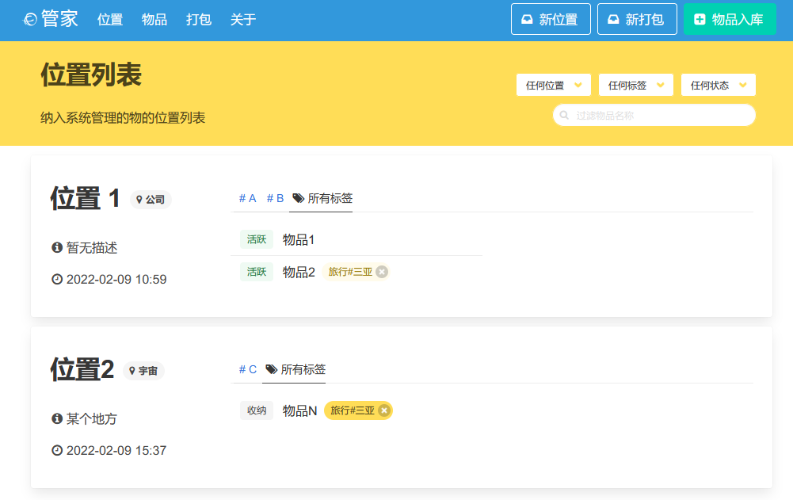

# 重力管家 - 模块化物品管理

一个模块化管理物品的 Web 应用，使用 clojure 和 clojurescript 搭建。源代码使用 GPLv2 协议开放，禁止用于商业用途。

## Prerequisites

使用 [Leiningen][1] 构建，依赖 postgreSQL 数据库。

[1]: https://github.com/technomancy/leiningen

## Features

- 使用 ClojureScript 和 Message Bus 应对前端状态变化，将副作用从视图分离。
- 使用 Clojure 的丰富表达能力、宏和动态特性实现鉴权并加快后端 API 开发。
- 使用 PostgreSQL 的 JSON 特性提供从前端直接到数据库的业务变更快速支持。

## Running
    
    //backend
    lein repl

    //frontend
    lein shadow watch app

界面示意图（默认密码 admin:admin）：

Copyright © 2022 Marvin Studio, Wuhan, China.