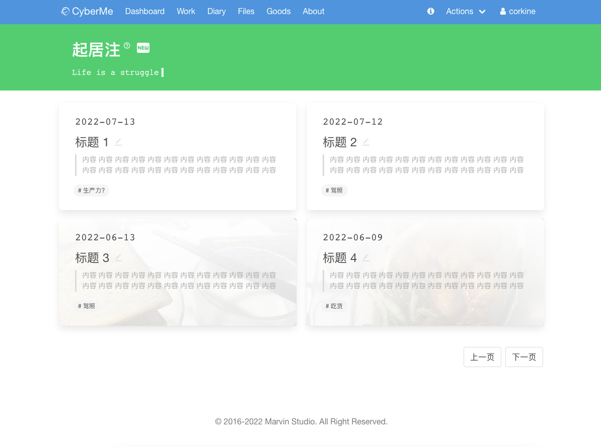

# CyberMe - 个人服务平台

一个 C/S 架构的 Web 应用，使用 clojure 和 clojurescript 搭建，用于高效、正确、可扩展的实现各种想法，提供对应服务。


[](https://github.com/corkine/cyberMe/actions/workflows/clojure.yml) [](https://circleci.com/gh/corkine/cyberMe/tree/cyber-me) [](https://codecov.io/gh/corkine/cyberMe) 

## Prerequisites

使用 [Leiningen][1] 构建，依赖 postgreSQL 数据库。

[1]: https://github.com/technomancy/leiningen

## Features

- 使用 ClojureScript 基于 React(reagent) 和 re-frame 通过事件模型应对前端状态变化，将副作用从视图分离，实现响应式前端交互界面。
- 使用 Clojure 的丰富表达能力、宏和动态特性实现后端鉴权、业务逻辑处理和第三方系统接入，并共享前后端代码：验证、路由和工具库。
- 使用 PostgresSQL 提供从前端直接到数据库的业务变更快速支持。

## Functions

### 快递追踪通知服务 

后台提供 API 从第三方服务商简单查询快递信息或(并)在后台定时确认快递更新，将更新信息推送到 iPhone Slack 频道。

后端服务 `src/clj/cyberme/cyber/express.clj`

前端组件 `src/cljs/cyberme/dashboard/core.cljs` 提供快递追踪录入表单。

### 美剧更新通知服务

后台定时从美剧网站查询感兴趣的美剧更新信息，存储到数据库并通知更新到 Web 界面或 iPhone Slack 频道。

后端服务 `src/clj/cyberme/media/mini4k.clj`

前端组件 `src/cljs/cyberme/dashboard/core.cljs` 提供美剧订阅录入表单和最近更新剧集展示。

### 喷嚏图卦新闻通知服务


后台在特定时间段抓取当日的“喷嚏图卦”，推送到 Slack 频道。

后端服务 `src/clj/cyberme/media/news.clj`

### 天气定期预报和预警服务


后台定时获取彩云天气 API 并提供配置文件地点天气信息，推送到 Slack 频道，并提供 API 以供查询

后端服务 `src/clj/cyberme/cyber/weather.clj`

### GPS 数据上报和轨迹追踪服务


后台提供 API 从 iPhone 等设备采集 GPS 信息，联动百度鹰眼和百度地图进行位置解析和记录上报（根据配置），以绘制活动轨迹。

后端服务 `src/clj/cyberme/cyber/track.clj`

### 跨设备便签同步服务

后台提供 API 从 iPhone 快捷指令、Web 界面表单、Flutter APP 新建便签，然后跨设备从 iPhone 快捷指令、Web 界面表单、Flutter APP 获取便签。

后端服务 `src/clj/cyberme/cyber/note.clj`

前端组件 `src/cljs/cyberme/dashboard/core.cljs` 提供 Web 界面的便签输入和最近便签获取。

### 图床上传服务

后台提供 API 上传图片到阿里云 OSS，前端提供拖拽和粘贴事件监测以自动上传并获取 URL。

后端服务 `src/clj/cyberme/cyber/file.clj`

前端组件 `src/cljs/cyberme/core.cljs` 提供 Web 界面的便签输入和最近便签获取。

### 植物每天浇水、每周一学提醒服务

后端提供植物每天浇水、每周一学数据库存储和相关 API，前端提供数据展示，增删改表单。

后端服务 `src/clj/cyberme/cyber/diary.clj`

前端组件 `src/cljs/cyberme/dashboard/core.clj` 提供的植物浇水、每周一学增删改查界面。

TODO: 后期实现数据库自动监听并调用 WebDriver 在服务器端完成学习任务

### 每周计划 KPI 与激励服务

后台提供每周计划与完成进度跟踪的增删改查 API，前端提供增删改查界面，以跟踪锻炼、学习、工作和饮食 KPI。每周计划联动 Microsoft TODO 和当日日记，完成 TODO 事项后，自行更新计划并跳转到日记界面。

后端服务 `src/clj/cyberme/cyber/week_plan.clj`

前端界面 `src/cljs/cyberme/dashboard/week_plan.cljs` `src/cljs/cyberme/diary/edit.cljs`

### Microsoft TODO 同步服务

后台定时从 Microsoft Graph API 获取 TODO 待办事项，和本地数据库进行交叉对比与同步，提供 API 进行展示和计分，此服务允许通过 OAuth 进行登录，用户凭证会自动刷新和维护。

后端服务 `src/clj/cyberme/cyber/todo.clj`

前端组件 `src/cljs/cyberme/dashboard/core.cljs` 提供 TODO 待办的展示。

### 每日生活提醒和习惯保持服务


后台提供 API 从 Apple Watch 和 iOS 健康应用通过自动化快捷指令上传饮食、站立、健身、心率和运动数据，进行按周计分，最长坚持计算并提供 Scriptable 小组件、Flutter APP 以及前端 Web 界面展示。

后端服务 `src/clj/cyberme/cyber/fitness.clj`

前端组件 `src/cljs/cyberme/dashboard/core.cljs` 提供可视化 Web 展示。

### HCM 打卡、加班和工时自动化服务


后台定时从 HCM 获取打卡信息，并提供 API 以提供加班时长查询、工作时长计算、统计和打卡提醒功能（以及一个实验性质的自动化服务，依赖移动设备在特定时间段执行自动化服务，后台定时查询其任务是否派发，如果失败提供通知功能）。

后端服务 `src/clj/cyberme/cyber/inspur.clj`

前端组件 `src/cljs/cyberme/dashboard/core.cljs` `src/cljs/cyberme/work`

### 物品管理服务


后端提供物品、位置、打包的增删改查服务，有 Web APP 和 Flutter APP 两个界面。

后端服务 `src/clj/cyberme/cyber/goods.clj`

前端组件 `src/cljs/cyberme/good` `src/cljs/cyberme/place` 提供美剧订阅录入表单和最近更新剧集展示。

### 心理学在线问卷和实验分发服务

提供前端的心理学在线实验和后端的实验数据收集服务，业务联系 <mailto:psych@mazhangjing.com>。

后端服务 `src/clj/cyberme/cyber/psych.clj`

前端组件 `src/cljs/cyberme/psych` 提供前端的心理学问卷和实验逻辑。

### 分布式任务分发和回收服务

后台提供分布式的任务下发、定时超时回收与重试、任务结果整理服务，另提供了基于 WebDriver 的带有 Proxy 代理、重试的爬虫示例。

后端服务 `src/clj/cyberme/cyber/task.clj`

前端爬虫 `demos/tasks` 中提供了基于 Firefox WebDriver 的带 Proxy 代理、重试的自动化服务

### 日记服务



后端提供日记的增删改和灵活查询服务，基于阿里云 OSS 的图片存储服务，有 Web APP 和 Flutter APP 两个界面。

**DayOne Integration：支持导入 DayOne 压缩包日记 JSON 数据并将图片上传到 OSS。**


后端服务 `src/clj/cyberme/cyber/diary.clj` `src/clj/cyberme/cyber/file.clj`

前端组件 `src/cljs/cyberme/diary` 提供日记的列表、单向展示，Markdown 编辑，图片拖拽上传等功能。

### 体重、正念、运动和锻炼管理

管理来自 iOS 客户端的 Apple Health 数据，并进行统计，在 Web 界面、iOS Widget 和 iOS、Flutter App 进行展示，包括 30 天体重管理，正念、运动和锻炼管理。

**HealthKit Integration：支持导出和写入 Apple Health 健康数据（需要 iOS 客户端）。**


后端服务 `src/clj/cyberme/cyber/fitness.clj` `src/clj/cyberme/client/ios.clj`

前端组件 `src/cljs/cyberme/dashboard/`

### 统一搜索服务

Ctrl + S 触发顶部搜索框，按照语法规则进行搜索。

#### Calibre 书籍搜索服务


后台维护 Calibre 书库（由 OneDrive 同步）元数据，对于书籍，可通过前端界面搜索书籍、更新书籍元数据，跳转到豆瓣读书、OneDrive 资源页、下载和预览 PDF 文件。

后端服务 `src/clj/cyberme/cyber/book.clj`

前端界面 `src/cljs/cyberme/file.cljs`

#### 磁盘文件元数据搜索服务


后台维护多个存储磁盘文件系统的元数据，对于磁盘文件，可通过前端界面搜索和查看路径、文件和文件夹信息。

后端服务 `src/clj/cyberme/media/disk.clj`

前端界面 `src/cljs/cyberme/file.cljs`

#### go.mazhangjing.com 短链接查询服务

对于短链接，提供搜索查询服务。

后端服务 `src/clj/cyberme/media/disk.clj`

前端界面 `src/cljs/cyberme/file.cljs`

#### yyets 人人影视资源检索服务


数据库来自[此项目](https://yyets.dmesg.app/)。

后端服务 `src/clj/cyberme/media/yyets.clj`

前端界面 `src/cljs/cyberme/file.clj`

## Scripts & Client

> 一些配合 CyberMe 使用的本地脚本(使用 clj-run 或 babashka)，比如上传 Calibre 数据库文件、磁盘元信息参见 /demos/scripts/README.md

另参见： [iOS Client by Swift](https://github.com/corkine/cyberMeSwift)


另参见： [Android Client by Flutter](https://github.com/corkine/cyberMeFlutter)

另参见： [FontEnd Client by ClojureScript](https://github.com/corkine/cyberMe) | [OpenSource Version](https://github.com/corkine/openCyberMe)

另参见： [BackEnd Server by Clojure](https://github.com/corkine/cyberMe) | [OpenSource Version](https://github.com/corkine/openCyberMe)

## Running
    
```shell
//backend
lein repl

//frontend
lein shadow watch app
```

## History

这个仓库的数万行代码是“自底向上”实现需求的典型范例，尽管这些需求长期零散的被各种语言、框架割裂，在迭代的过程中被重构、更新或者废弃，下面是我实现这些零散的需求的历史，大部分都是在接触过一门语言后拿来练手的项目，代码风格千变万化，大部分仓库可以在 [这里](https://github.com/corkine) 找到。CyberMe Clojure 实现将这些零散的特性整合了起来，配合 ClojureScript 和 Reagent/re-frame 实现了高效开发和联动，提供了统一的使用体验。


由 [Jetbrains OpenSource Support](https://jb.gg/OpenSourceSupport) 提供开发支持


Copyright © 2022 Marvin Studio, Wuhan, China.