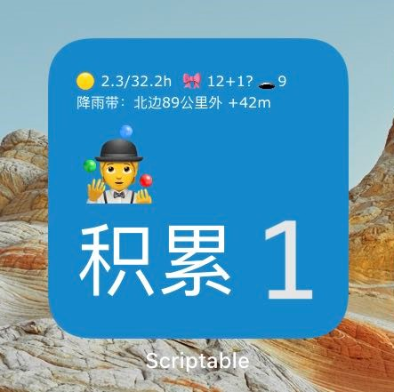

# CyberMe Script Collection

此处存放着配合 CyberMe 服务端使用的信息采集脚本。 一些敏感的用户凭据从环境变量中读取。

## clj_runner.go

clj-runner 是一个根据 .clj 脚本文件头行判断如何执行此文件的“派发器”：[仓库](https://github.com/corkine/clj-runner)。

每个 .clj 脚本都可以独立的通过 clj-runner 执行，其判断 .clj 文件头，并且决定使用何种方式来运行脚本：使用 `#!/usr/bin/env bb` 开头的交给 babashka 运行，其余的将第一行注释转换为命令行执行，比如 `bb clojure -Sdeps '{:paths ["."]}' -M -m xx.clj` 或者 `clojure -Sdeps '{:paths ["."]}' -M -m xx.clj` —— Clojure CLI 将依赖本地 .m2 仓库缓存的库执行代码，这种动态调用让大部分脚本的任务能够比 bash/powershell 脚本更快运行，而少部分复杂任务、项目和后台服务也可以在 JVM 虚拟机上高效执行。在 Windows下，将 clj-runner 关联 .clj 文件后可双击执行 Clojure 脚本。

## backup.clj

一个用于备份文件夹的命令行界面，依赖 *UNIX 系统：cp、mkdir 和 rsync。可以将文件夹直接备份到指定位置，备份前允许有提示，可以为特定文件夹中每个子项生成备份计划：复制 or 移动 or 跳过，然后统一执行备份任务。

## auto-backup.clj

一个用于将特定目录特定类型、文件名前缀的文件和文件夹压缩并执行命令上传到 OSS 的脚本，依赖 Windows 和 WSL（OSSUtil）。

## calibre_upload.clj

一个用来在特定目录下寻找 Calibre 元数据文件 metadata.db 并将其加密上传到 CyberMe 以供搜索的脚本。

## files-metadata-upload.clj

一个用来将特定磁盘所有文件元数据加密上传到 CyberMe 以供搜索的脚本。

## zendao.js

一个自动将 CyberMe 中的当日 Microsoft TODO 待办事项 - 工作列表部分写入禅道日报系统字段的脚本，配合 Tampermonkey 使用。

## overtime.js

一个自动将内部加班系统点击事件上传到 CyberMe 的脚本，配合 Tampermonkey 使用。

## scriptable.js

一个依赖 CyberMe API 在 iOS 桌面小组件显示信息的 JavaScript 脚本，配合 Scriptable 使用。

